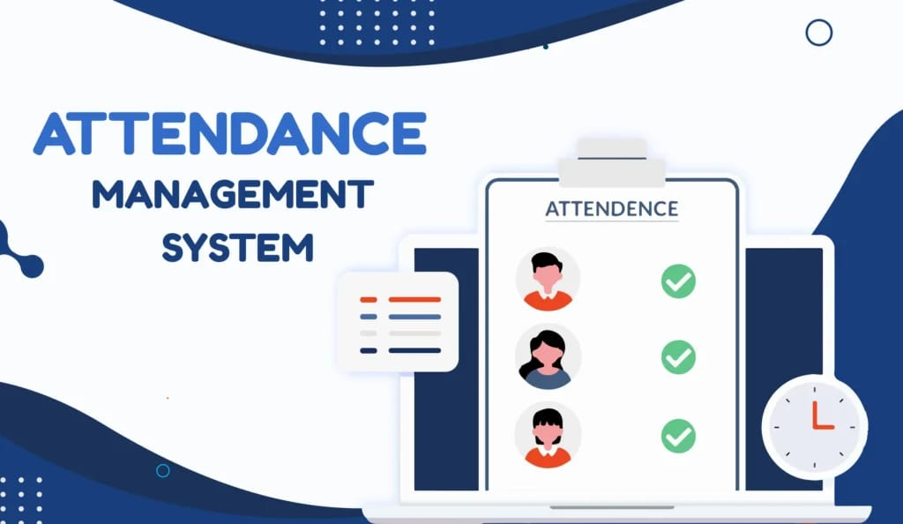
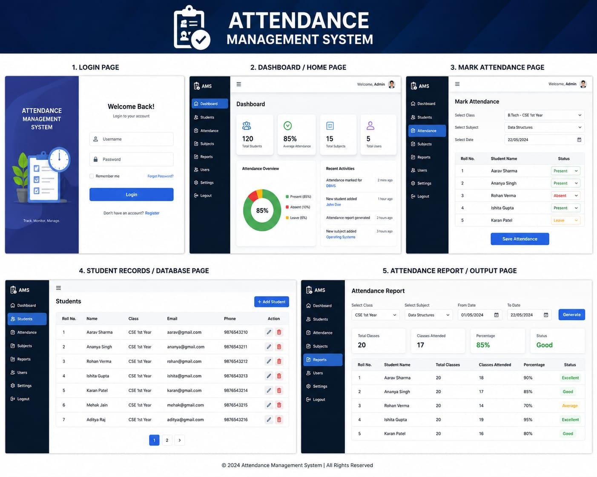
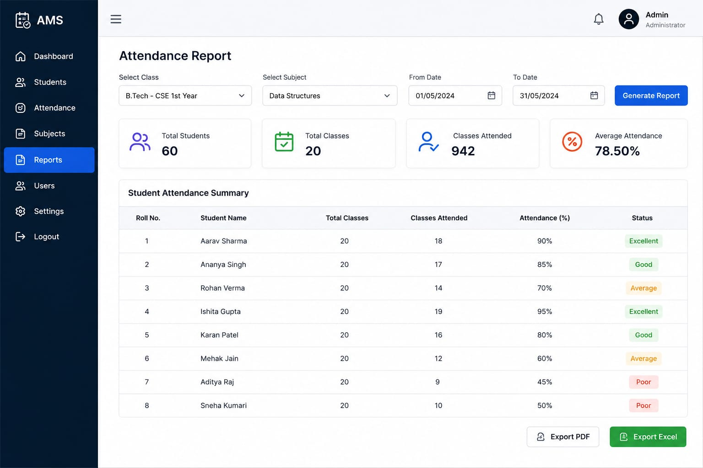
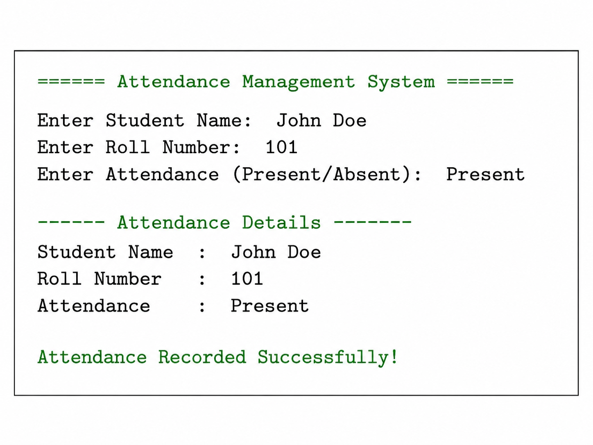

# 📋Attendance-Management-System
The Attendance Management System is a digital application used to manage student attendance records efficiently. It helps reduce manual work, saves time, and improves accuracy in attendance tracking. The system allows easy recording, monitoring, and management of attendance data for schools and colleges.

---

## 📖 OVERVIEW

The Attendance Management System is a software application developed to manage and maintain student attendance records digitally. This project helps schools and colleges reduce manual paperwork and improve the accuracy of attendance tracking. It provides an efficient and organized way to record, store, and monitor attendance data.

---

## 🎯 OBJECTIVES

- Reduce manual work in attendance management
- Improve attendance accuracy
- Save time for teachers and administrators
- Maintain attendance data digitally
- Generate attendance reports easily

---

## ✨ FEATURES

- 📝 Digital attendance recording
- 📊 Automatic attendance calculation
- 👨‍🎓 Student record management
- 📅 Daily attendance tracking
- 📈 Attendance report generation
- 🔒 Secure data storage
- 💻 User-friendly interface

---

## ⚙️ HOW IT WORKS (METHODOLOGY)

- Step 1: The teacher logs into the Attendance Management System.
- Step 2: Student details and attendance information are entered.
- Step 3: Python code processes and stores the attendance records.
- Step 4: The system calculates attendance automatically.
- Step 5: Attendance reports are generated and maintained digitally.

---

## 🛠 TECHNOLOGIES USED

- 🌐 HTML
- 🎨 CSS
- ⚡ JavaScript
- 🐍 Python
- 🗄 MySQL Database

---

## ✅ ADVANTAGES

- ⏳ Saves time and effort  
- 📉 Reduces paperwork  
- ✔️ Improves accuracy  
- 📂 Easy access to records  
- 📋 Organized data management  
- 🚀 Fast attendance tracking  
- 🔒 Secure storage of attendance data  

---

## 🖥️⚙️ SYSTEM OVERVIEW AND DESIGN





---

## ▶️ Execution

```bash
python attendance.py
```
---

## 🖥️ Sample Output



---

## 🔮 FUTURE ENHANCEMENTS

- 📱 Mobile application support
- ☁ Cloud database integration
- 📧 Email notifications for attendance updates
- 👨‍🏫 Faculty and student login system
- 📊 Advanced attendance analytics and reports
- 🔐 Improved security and data protection
- 🌐 Online attendance management system

---

## 🔚 CONCLUSION

The Attendance Management System is a useful and efficient software application for managing student attendance digitally. It reduces manual work, saves time, improves accuracy, and helps educational institutions maintain attendance records in an organized manner. The system provides a simple, fast, and reliable method for recording and monitoring attendance data, making attendance management easier for teachers and administrators.

---

## 👩‍💻 DEVELOPED BY

V.Keerthana


